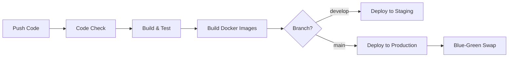

# Warehouse & Supply Chain Management System 🚚📦

[](https://github.com/ataraxia1630/Warehouse-and-Supply-Chain-Management-System/actions)
[](https://github.com/ataraxia1630/Warehouse-and-Supply-Chain-Management-System/actions)
[](https://github.com/ataraxia1630/Warehouse-and-Supply-Chain-Management-System/actions)
[](https://github.com/ataraxia1630/Warehouse-and-Supply-Chain-Management-System/actions)
[](https://github.com/ataraxia1630/Warehouse-and-Supply-Chain-Management-System/issues)
[](https://github.com/ataraxia1630/Warehouse-and-Supply-Chain-Management-System/pulls)
[](https://github.com/ataraxia1630/Warehouse-and-Supply-Chain-Management-System/commits/main)
[](https://github.com/ataraxia1630/Warehouse-and-Supply-Chain-Management-System/blob/main/LICENSE)

---

### Tech & Tooling

[](https://www.typescriptlang.org)
[](https://nodejs.org)
[](https://nestjs.com)
[](https://www.prisma.io)
[](https://reactjs.org)
[](https://vitejs.dev)
[](https://www.docker.com)
[](https://www.terraform.io)
[](https://www.postgresql.org)
[](https://www.mongodb.com)
[](https://eslint.org)
[](https://prettier.io)
[](https://playwright.dev)
[](https://www.testcontainers.org)

---

**Production-ready** enterprise warehouse and supply-chain management system built with **Modular Monolith** architecture. Features comprehensive DevOps practices including CI/CD pipelines, Infrastructure as Code (Terraform), automated testing (unit, integration, e2e), monitoring with Azure Managed Grafana, and complete operational documentation.

**Backend:** NestJS + Prisma ORM + PostgreSQL + MongoDB  
**Frontend:** React 18 + Material-UI + Vite  
**Infrastructure:** Docker + Azure App Service + Terraform  
**Testing:** Jest + Testcontainers + Playwright  
**Monitoring:** Prometheus + Grafana + Application Insights

---

## Table of contents

- [Project Status](#project-status)
- [Key features](#key-features)
- [Architecture & modules](#architecture--modules)
- [Tech stack](#tech-stack)
- [Repository layout](#repository-layout)
- [Quickstart (Local development)](#quickstart-local-development)
  - [Prerequisites](#prerequisites)
  - [Backend (dev)](#backend-dev)
  - [Frontend (dev)](#frontend-dev)
  - [Database & Migrations](#database--migrations)
  - [Docker & compose (local)](#docker--compose-local)
- [Testing](#testing)
- [CI / CD](#ci--cd)
- [Infrastructure & Deployment](#infrastructure--deployment)
- [Monitoring & Observability](#monitoring--observability)
- [Security & RBAC](#security--rbac)
- [Useful scripts & commands](#useful-scripts--commands)
- [Contributing & contacts](#contributing--contacts)
- [References & docs](#references--docs)

---

## Project status ✅

**Production-ready (Final Phase - January 2026).** All 12 core modules are fully implemented and tested:

✅ Product Management (Categories, Products, Batches)  
✅ Warehouse Management (Facilities, Locations)  
✅ Inventory Management (Stock Tracking, Movements)  
✅ Procurement (Suppliers, Purchase Orders)  
✅ Sales (Customers, Sales Orders)  
✅ Logistics (Shipments, Tracking)  
✅ Demand Planning (Forecasting)  
✅ Reporting & Analytics  
✅ Alerts & Notifications  
✅ User Management & Authentication  
✅ Audit & Compliance Logging  
✅ Authorization & RBAC

**Infrastructure & Operations:**  
✅ Complete CI/CD pipeline with GitHub Actions  
✅ Infrastructure as Code (Terraform) for Azure  
✅ Blue-Green deployment for zero-downtime releases  
✅ Monitoring with Prometheus + Grafana  
✅ Comprehensive test suite (unit, integration, e2e)  
✅ Complete operational runbooks and playbooks

---

## Key features ✨

### Architecture & Design

- **Modular Monolith** with Domain-Driven Design (DDD) principles
- 12 bounded contexts with clear module boundaries
- 3-layer architecture: Controller → Service → Repository
- **Polyglot Persistence**: PostgreSQL (19 tables) + MongoDB (2 collections)

### Security & Access Control

- JWT-based authentication (access + refresh tokens)
- Role-Based Access Control (RBAC) with 8 user roles
- 50+ permission mappings across all modules
- Comprehensive audit logging with TTL (180 days)

### DevOps & Quality Assurance

- **CI/CD**: GitHub Actions with 5 automated workflows
- **Blue-Green Deployment**: Zero-downtime production releases
- **Comprehensive Testing**:
  - Unit tests with Jest (controllers, services, repositories)
  - Integration tests with Testcontainers (real PostgreSQL + MongoDB)
  - E2E tests with Playwright (frontend workflows)
  - Smoke tests for quick validation
- **Test Coverage**: Automated coverage reporting with Jest

### Infrastructure & Monitoring

- **IaC**: Complete Terraform modules for Azure deployment
- **Containerization**: Docker images published to GitHub Container Registry
- **Monitoring Stack**:
  - Prometheus metrics from NestJS backend
  - Azure Managed Grafana dashboards
  - Application Insights for distributed tracing
  - Custom alerts for critical operations

### Operational Excellence

- Complete runbook with deployment procedures
- Rollback playbooks for incident response
- Health check endpoints and automated monitoring
- Comprehensive documentation (Architecture, Database, RBAC, Monitoring)

---

## Architecture & modules 🏗️

### Design Pattern

**Modular Monolith** with Domain-Driven Design (DDD) principles, built on NestJS framework.

### Module Structure

Each module follows a consistent 3-layer architecture:

- **Controller Layer**: HTTP/API endpoints, request/response handling
- **Service Layer**: Business logic, domain rules, orchestration
- **Repository Layer**: Data persistence, database queries

### 12 Bounded Contexts

| Module                     | Description                                     | Database             |
| -------------------------- | ----------------------------------------------- | -------------------- |
| **Product Management**     | Product catalog, categories, batch/lot tracking | PostgreSQL           |
| **Warehouse Management**   | Physical facilities and storage locations       | PostgreSQL           |
| **Inventory Management**   | Stock levels, movements, reservations           | PostgreSQL           |
| **Procurement**            | Supplier management, purchase orders            | PostgreSQL           |
| **Sales**                  | Customer management, sales orders               | PostgreSQL           |
| **Logistics**              | Shipment management, delivery tracking          | PostgreSQL           |
| **Demand Planning**        | Sales forecasting, demand prediction            | PostgreSQL           |
| **Reporting & Analytics**  | Business intelligence, historical analysis      | PostgreSQL           |
| **Alerts & Notifications** | Real-time event notifications (TTL: 90 days)    | MongoDB              |
| **User Management**        | User accounts, authentication, refresh tokens   | PostgreSQL           |
| **Audit & Compliance**     | Security audit trails (TTL: 180 days)           | MongoDB              |
| **Authorization (RBAC)**   | Role-based access control, permissions          | In-memory + Database |

### Polyglot Persistence

- **PostgreSQL (19 tables)**: ACID-compliant transactional data
- **MongoDB (2 collections)**: Operational data with TTL requirements

📖 See [docs/ARCHITECTURE.md](docs/ARCHITECTURE.md) for detailed diagrams, [docs/DATABASE.md](docs/DATABASE.md) for schema design, and [docs/RBAC.md](docs/RBAC.md) for permission matrix.

---

## Tech stack 🔧

### Backend

- **Runtime**: Node.js 20 LTS
- **Framework**: NestJS 11 (TypeScript)
- **ORM**: Prisma 6
- **Authentication**: JWT (access + refresh tokens), Passport.js
- **Validation**: class-validator, class-transformer
- **API Documentation**: Swagger/OpenAPI
- **Caching**: Node-cache (in-memory)
- **Scheduling**: @nestjs/schedule (cron jobs)

### Frontend

- **Framework**: React 18
- **Build Tool**: Vite 6
- **UI Library**: Material-UI (MUI) v7
- **State Management**: Zustand
- **Routing**: React Router v7
- **HTTP Client**: Axios
- **Forms**: React Hook Form + Yup validation
- **Date Handling**: date-fns, MUI X Date Pickers

### Databases

- **PostgreSQL 14+**: Neon DB (transactional data, 19 tables)
- **MongoDB 6+**: MongoDB Atlas (operational data, 2 collections)

### DevOps & Infrastructure

- **Containerization**: Docker, Docker Compose
- **Container Registry**: GitHub Container Registry (GHCR)
- **Cloud Provider**: Microsoft Azure
- **Hosting**: Azure App Service (Web Apps)
- **IaC**: Terraform 1.5+
- **CI/CD**: GitHub Actions
- **Deployment**: Blue-Green deployment with Azure slots

### Monitoring & Observability

- **Metrics**: Prometheus (prom-client)
- **Dashboards**: Azure Managed Grafana
- **APM**: Azure Application Insights
- **Logs**: Azure Log Analytics Workspace

### Testing

- **Unit Tests**: Jest
- **Integration Tests**: Jest + Testcontainers
- **E2E Tests**: Playwright
- **API Testing**: Supertest
- **Coverage**: Jest coverage reports

### Code Quality

- **Linting**: ESLint 9
- **Formatting**: Prettier
- **Type Checking**: TypeScript 5

---

## Repository layout 📁

- `/backend` — NestJS app, Prisma schema, scripts, tests
- `/frontend` — React app (Vite), Playwright e2e tests
- `/iac` — Terraform modules & envs (production, staging)
- `/docs` — Architecture, Runbook, Monitoring, DB, RBAC, Rollback Playbook
- `docker-compose.yml`, `Dockerfile.prod`, `nginx.conf` — deployment artifacts
- `.github/workflows` — CI/CD pipelines

---

## Quickstart (Local development) ⚡

### Prerequisites

- Node.js 20 LTS
- npm (or pnpm/yarn)
- Docker (for running DBs or compose)
- Terraform (only if working with `iac/`)

### Backend (dev)

1. Install deps and generate Prisma client

```bash
cd backend
npm ci
npx prisma generate
```

2. Copy or create `.env` (example environment variables)

```env
DATABASE_URL=postgresql://localhost:5432/warehouse_dev
MONGO_URL=mongodb://localhost:27017/warehouse_dev
JWT_ACCESS_SECRET=changeme
JWT_REFRESH_SECRET=changeme
NODE_ENV=development
PORT=3000
```

3. Run migrations (development)

```bash
npm run db:migrate
# or use prisma directly
npx prisma migrate dev --name init
```

4. Start dev server

```bash
npm run start:dev
# Backend default: http://localhost:3000
```

> Health check: `GET /health` (returns 200 when healthy)

### Frontend (dev)

```bash
cd frontend
npm ci
npm run dev
# Frontend default: Vite (e.g., http://localhost:5173)
```

### Database & Migrations

**Schema Overview:**

- **19 PostgreSQL tables** across 8 modules
- **2 MongoDB collections** (audit_logs, alerts)

**Development workflow:**

```bash
cd backend

# Generate Prisma client
npm run prisma:generate

# Create and apply migration
npm run db:migrate
# or: npx prisma migrate dev --name your_migration_name

# Inspect database with Prisma Studio
npm run prisma:studio

# Seed database with sample data
npx tsx prisma/seed.ts
```

**Important files:**

- Schema: `backend/prisma/schema.prisma` (19 models)
- Seed script: `backend/prisma/seed.ts`
- Migration history: `backend/prisma/migrations/`
- Seed guide: `backend/SEED_DATA_GUIDE.md`

📖 See [docs/DATABASE.md](docs/DATABASE.md) for complete schema documentation and ERD.

### Docker & compose (local)

**Quick start** using Docker Compose (builds/proxies frontend + backend):

```bash
# Start all services (backend + frontend + databases)
docker-compose up --build

# Start in detached mode
docker-compose up -d

# View logs
docker-compose logs -f

# Stop services
docker-compose down

# Production build
docker-compose -f docker-compose.prod.yml up --build
```

**Published Docker Images:**

- Backend: `ghcr.io/se214-semicolon/warehouse-and-supply-chain-management-system/backend`
- Frontend: `ghcr.io/se214-semicolon/warehouse-and-supply-chain-management-system/frontend`

**Image tags:**

- `latest`: Latest build from main branch
- `main-{sha}`: Specific commit from main branch
- `develop-{sha}`: Specific commit from develop branch

**Dockerfiles:**

- Backend: [backend/Dockerfile.prod](backend/Dockerfile.prod)
- Frontend: [frontend/Dockerfile.prod](frontend/Dockerfile.prod)

---

## Testing 🧪

### Test Strategy

The project implements a comprehensive test pyramid with multiple test types:

### Backend Tests (Jest)

```bash
cd backend

# Run all tests
npm test

# Unit tests only (fast, mocked dependencies)
npm run test:unit

# Integration tests (Testcontainers - real PostgreSQL + MongoDB)
npm run test:integration
# or: ./scripts/run-tests-by-type.sh integration

# Smoke tests (quick sanity checks)
npm run test:smoke

# Sanity tests (startup and basic functionality)
npm run test:sanity

# Coverage report
npm run test:cov

# Watch mode
npm run test:watch

# Quick validation (unit + smoke)
npm run test:quick

# Full test suite
npm run test:full
```

**Test Files:**

- Unit tests: `**/*.spec.ts` (co-located with source)
- Integration tests: `**/*.integration-test.ts`
- Smoke tests: `tests/smoke/**/*.ts`
- Sanity tests: `**/*.sanity-test.ts`

### Frontend Tests

**Unit/Integration Tests (Vitest):**

```bash
cd frontend

# Run all tests
npm test

# Run once (CI mode)
npm run test:run

# Watch mode
npm run test:watch

# Coverage
npm run test:coverage

# UI mode
npm run test:ui
```

**E2E Tests (Playwright):**

```bash
# Install browsers (first time)
npm run playwright:install

# Run all e2e tests
npm run test:e2e

# Run with UI mode
npm run test:e2e:ui

# Run in headed mode (see browser)
npm run test:e2e:headed

# Run specific suites
npm run test:smoke        # @smoke tagged tests
npm run test:sanity       # @sanity tagged tests
npm run test:regression   # @regression tagged tests
```

**Test Files:**

- Unit tests: `tests/**/*.test.jsx`
- E2E tests: `e2e/**/*.spec.js`

### CI/CD Testing

GitHub Actions runs automated tests on every push:

- **Workflow**: [.github/workflows/test-matrix.yml](.github/workflows/test-matrix.yml)
- **Includes**: Unit, integration (Testcontainers), smoke, and sanity tests
- **Coverage**: Automatically collected and reported

### Testcontainers

Integration tests use **Testcontainers** to spin up real databases:

- PostgreSQL container for Prisma operations
- MongoDB container for audit logs and alerts
- Automatic cleanup after tests

---

## CI / CD 🔁

### GitHub Actions Workflows

The project uses 5 automated workflows:

| Workflow                  | File                                                                     | Trigger                   | Purpose                                              |
| ------------------------- | ------------------------------------------------------------------------ | ------------------------- | ---------------------------------------------------- |
| **Code Check**            | [code-check.yml](.github/workflows/code-check.yml)                       | Push, PR                  | ESLint, TypeScript type-check, Prettier format check |
| **Build & Test**          | [build-and-test.yml](.github/workflows/build-and-test.yml)               | Called by other workflows | Build apps, run unit tests                           |
| **Test Matrix**           | [test-matrix.yml](.github/workflows/test-matrix.yml)                     | Push, PR                  | Unit, integration (Testcontainers), smoke tests      |
| **Deploy Apps**           | [deploy-apps.yml](.github/workflows/deploy-apps.yml)                     | Push to main/develop      | Build Docker images, deploy to Azure                 |
| **Deploy Infrastructure** | [deploy-infrastructure.yml](.github/workflows/deploy-infrastructure.yml) | Changes to `iac/`         | Apply Terraform configurations                       |

### Deployment Pipeline



**Deployment Flow:**

1. **Code Quality**: ESLint, TypeScript, Prettier
2. **Testing**: Unit tests + Integration tests (Testcontainers)
3. **Build**: Docker images for backend and frontend
4. **Push**: Images to GitHub Container Registry (GHCR)
5. **Deploy**:
   - `develop` branch → Staging environment
   - `main` branch → Production environment (Blue-Green)

### Blue-Green Deployment (Production)

Production uses **Blue-Green deployment** with Azure App Service slots:

1. **Deploy to Staging Slot**: New version deployed to staging slot
2. **Health Check**: Verify `/health` endpoint returns HTTP 200
3. **Slot Swap**: Swap staging ↔ production (zero-downtime)
4. **Verification**: Final health check on production
5. **Rollback**: Quick rollback by swapping slots again if needed

**Benefits:**

- Zero-downtime deployments
- Instant rollback capability (< 1 minute)
- Safe pre-production validation

### Required GitHub Secrets

**Azure Credentials:**

- `AZURE_CREDENTIALS` - Azure Service Principal JSON
- `ARM_SUBSCRIPTION_ID`, `ARM_CLIENT_ID`, `ARM_CLIENT_SECRET`, `ARM_TENANT_ID`

**Database Connection Strings:**

- `EXTERNAL_POSTGRES_URL` - PostgreSQL connection string (Neon DB)
- `EXTERNAL_MONGODB_URL` - MongoDB connection string (Atlas)

**JWT Secrets:**

- `JWT_ACCESS_SECRET_STAGING`, `JWT_ACCESS_SECRET_PRODUCTION`
- `JWT_REFRESH_SECRET_STAGING`, `JWT_REFRESH_SECRET_PRODUCTION`

**Container Registry:**

- `DOCKER_REGISTRY_USERNAME` - GitHub username
- `DOCKER_REGISTRY_PASSWORD` - GitHub personal access token

📖 See [docs/RUNBOOK.md](docs/RUNBOOK.md) for detailed deployment procedures.

---

## Infrastructure & Deployment ☁️

### Infrastructure as Code (Terraform)

All infrastructure is managed as code in the `iac/` directory:

```
iac/
├── modules/              # Reusable Terraform modules
│   ├── app-service/     # Azure App Service configuration
│   ├── database/        # Database setup (Neon DB connection)
│   ├── monitoring/      # Grafana, Azure Monitor, dashboards
│   └── networking/      # VNet, subnets, NSG
├── environments/         # Environment-specific configurations
│   ├── production/      # Production environment variables
│   └── staging/         # Staging environment variables
└── scripts/             # Helper scripts
    ├── setup-azure.sh   # Initial Azure setup
    ├── health-check.sh  # Deployment health verification
    └── generate-secrets.sh
```

### Azure Resources

**Deployed Resources:**

- **App Services**: Backend (NestJS) + Frontend (React)
- **App Service Plans**: Linux-based, scalable
- **Deployment Slots**: Production + Staging (for Blue-Green)
- **Key Vault**: Secrets management
- **Managed Grafana**: Monitoring dashboards
- **Azure Monitor Workspace**: Prometheus metrics
- **Application Insights**: Distributed tracing and logs
- **Log Analytics Workspace**: Centralized logging
- **Virtual Network**: Network isolation
- **Network Security Groups**: Firewall rules

### Deployment Commands

**Manual Terraform deployment:**

```bash
# Navigate to environment
cd iac/environments/staging  # or production

# Initialize Terraform
terraform init

# Review planned changes
terraform plan -out=tfplan

# Apply changes
terraform apply tfplan

# Verify deployment
../../scripts/health-check.sh staging
```

**Automated deployment** via GitHub Actions:

- Triggered on changes to `iac/` directory
- Runs `terraform plan` on PRs (preview)
- Runs `terraform apply` on merge to main

### External Services

**Databases (Managed externally):**

- **Neon DB** (PostgreSQL): Serverless PostgreSQL with automatic scaling
- **MongoDB Atlas**: Managed MongoDB with automatic backups

📖 See [iac/README.md](iac/README.md) and [docs/INFRASTRUCTURE.md](docs/INFRASTRUCTURE.md) for detailed infrastructure documentation.

---

## Monitoring & Observability 📈

### Monitoring Stack

```
┌─────────────────────────────────────────────────────────────┐
│                      Azure Cloud                             │
│  ┌──────────────┐    ┌─────────────────┐    ┌────────────┐ │
│  │   Backend    │───▶│  Azure Monitor  │───▶│   Azure    │ │
│  │   /metrics   │    │  (Prometheus)   │    │   Managed  │ │
│  │              │    │                 │    │   Grafana  │ │
│  └──────────────┘    └─────────────────┘    └────────────┘ │
│         │                                          │         │
│         └──────────▶ Application Insights ────────┘         │
└─────────────────────────────────────────────────────────────┘
```

### Metrics Collection

**Automatically Collected (DevOps Scope):**

- `http_requests_total` - Total HTTP requests
- `http_request_duration_seconds` - Request latency
- `process_cpu_seconds_total` - CPU usage
- `process_resident_memory_bytes` - Memory usage
- `nodejs_eventloop_lag_seconds` - Event loop lag
- `nodejs_heap_size_*` - Heap memory metrics
- `nodejs_active_resources_total` - Active handles

**Optional Business Metrics** (can be enabled in code):

- `orders_total` - Total orders by status/warehouse
- `inventory_movements_total` - Stock movements
- `low_stock_alerts_total` - Low stock notifications

### Dashboards

**Pre-configured Grafana dashboards:**

- **System Overview**: CPU, memory, request rate, latency
- **HTTP Metrics**: Request count, response times, error rates
- **Node.js Metrics**: Event loop, heap memory, GC
- **Business Metrics**: Orders, inventory, alerts (if enabled)

**Dashboard location**: `iac/modules/monitoring/dashboards/`

### Alerting

**Critical Alerts:**

- High error rate (>5% HTTP 5xx responses)
- High latency (>2s p95 response time)
- Low memory (<200MB available)
- High event loop lag (>1s)
- Service unavailable (health check fails)

### Access Points

**Grafana Dashboard:**

- Staging: `https://warehouse-mgmt-staging-grafana.grafana.azure.com`
- Production: `https://warehouse-mgmt-production-grafana.grafana.azure.com`

**Backend Metrics Endpoint:**

```bash
# Local
curl http://localhost:3000/metrics

# Production
curl https://warehouse-mgmt-production-backend.azurewebsites.net/metrics
```

**Health Check:**

```bash
# Local
curl http://localhost:3000/health

# Production
curl https://warehouse-mgmt-production-backend.azurewebsites.net/health
```

📖 See [docs/MONITORING.md](docs/MONITORING.md) for complete monitoring setup and troubleshooting guide.

---

## Security & RBAC 🔒

### Authentication

**JWT-based authentication** with dual-token strategy:

- **Access Token**: Short-lived (15 minutes), used for API requests
- **Refresh Token**: Long-lived (7 days), used to obtain new access tokens
- Tokens stored in `refresh_tokens` table (PostgreSQL)
- Automatic token rotation on refresh

### Authorization (RBAC)

**8 User Roles:**

| Role                | Code              | Primary Responsibility                    |
| ------------------- | ----------------- | ----------------------------------------- |
| **Admin**           | `admin`           | Full system access, user management       |
| **Manager**         | `manager`         | Oversight, approvals, strategic decisions |
| **Warehouse Staff** | `warehouse_staff` | Daily inventory operations                |
| **Procurement**     | `procurement`     | Supplier and purchase order management    |
| **Sales**           | `sales`           | Customer and sales order management       |
| **Logistics**       | `logistics`       | Shipment and delivery management          |
| **Analyst**         | `analyst`         | Forecasting, reporting, analytics         |
| **Partner**         | `partner`         | Limited tracking access (external)        |

**Permission Matrix:**

- **50+ permissions** across 12 modules
- Granular access control: Create, Read, Update, Delete
- Module-specific permissions (e.g., `inventory:receive`, `sales:create-order`)
- Read-only access for analysts and partners

### Audit & Compliance

**Comprehensive audit logging:**

- All critical operations logged to MongoDB `audit_logs` collection
- Captures: user ID, action, resource, timestamp, IP address, changes
- **TTL**: 180 days (automatic cleanup)
- Queryable by date range, user, action type, resource

**Logged Operations:**

- User authentication (login, logout, token refresh)
- Data modifications (create, update, delete)
- Permission-critical actions (order approval, inventory adjustment)
- Admin actions (user management, role changes)

### Security Best Practices

✅ Password hashing with bcrypt (salt rounds: 10)  
✅ JWT secrets managed via Azure Key Vault  
✅ Database connection strings encrypted  
✅ HTTPS-only in production  
✅ CORS configured with allowed origins  
✅ Rate limiting on authentication endpoints  
✅ Input validation with class-validator  
✅ SQL injection prevention via Prisma ORM  
✅ XSS protection with Content Security Policy

### Testing RBAC

```bash
cd backend

# Run RBAC test suite
npm run rbac:test

# Comprehensive RBAC validation
npm run rbac:full
```

**Test Scripts:**

- [scripts/rbac-tests.ps1](backend/scripts/rbac-tests.ps1)
- [scripts/rbac-comprehensive.ps1](backend/scripts/rbac-comprehensive.ps1)

📖 See [docs/RBAC.md](docs/RBAC.md) for complete permission matrix and role definitions.

---

## Useful scripts & commands 🧰

### Backend Scripts

```bash
cd backend

# Development
npm run start:dev              # Start in watch mode
npm run build                  # Production build
npm run start:prod             # Run production build

# Testing
npm run test:unit              # Unit tests
npm run test:integration       # Integration tests (Testcontainers)
npm run test:smoke             # Smoke tests
npm run test:cov               # Coverage report
./scripts/run-tests-by-type.sh integration  # Alternative integration test script

# Code Quality
npm run lint                   # ESLint
npm run format                 # Prettier format
npm run format:check           # Check formatting

# Database
npm run prisma:generate        # Generate Prisma client
npm run db:migrate             # Run migrations (dev)
npm run db:migrate:prod        # Run migrations (prod)
npm run prisma:studio          # Open Prisma Studio GUI
npx tsx prisma/seed.ts         # Seed database

# RBAC Testing
npm run rbac:test              # Quick RBAC tests
npm run rbac:full              # Comprehensive RBAC tests

# Utilities
npm run tokens                 # Generate JWT tokens for testing
./scripts/check-code-quality.sh  # Run all quality checks
```

### Frontend Scripts

```bash
cd frontend

# Development
npm run dev                    # Start dev server (Vite)
npm run build                  # Production build
npm run preview                # Preview production build

# Testing
npm test                       # Unit tests (Vitest)
npm run test:e2e               # E2E tests (Playwright)
npm run test:smoke             # Smoke tests
npm run test:coverage          # Coverage report
npm run playwright:install     # Install Playwright browsers

# Code Quality
npm run lint                   # ESLint
```

### Infrastructure Scripts

```bash
cd iac

# Setup
./scripts/setup-azure.sh       # Initial Azure setup
./scripts/create-service-principal.sh  # Create Azure SP
./scripts/generate-secrets.sh  # Generate JWT secrets

# Deployment
cd environments/staging        # or production
terraform init
terraform plan -out=tfplan
terraform apply tfplan

# Verification
../../scripts/health-check.sh staging  # Check deployment health

# Utilities
./scripts/cost-optimizer.sh    # Analyze and optimize Azure costs
./scripts/terraform-local.sh   # Run Terraform locally with proper env
```

### Docker Commands

```bash
# Local Development
docker-compose up --build      # Start all services
docker-compose down            # Stop all services
docker-compose logs -f         # View logs

# Production Build
docker-compose -f docker-compose.prod.yml up --build

# Individual Services
docker-compose up backend      # Start backend only
docker-compose up frontend     # Start frontend only

# Cleanup
docker-compose down -v         # Remove volumes
docker system prune -a         # Clean up all unused resources
```

### Useful One-Liners

```bash
# Full local setup
npm ci && npx prisma generate && npx prisma migrate dev && npm run start:dev

# Run all tests
npm run test:unit && npm run test:smoke && npm run test:integration

# Code quality check
npm run format:check && npm run lint && npm run build

# Health check production
curl -f https://warehouse-mgmt-production-backend.azurewebsites.net/health || echo "Service unhealthy"

# Quick database reset (dev only)
npx prisma migrate reset --force && npx tsx prisma/seed.ts
```

---

## Contributing & contacts 🤝

### Contributing Guidelines

**Branch Strategy:**

- `main`: Production-ready code (protected)
- `develop`: Development branch (protected)
- `feature/*`: New features
- `bugfix/*`: Bug fixes
- `hotfix/*`: Critical production fixes

**Pull Request Process:**

1. Create feature branch from `develop`
2. Make changes and write tests
3. Ensure all CI checks pass:
   - ✅ Code formatting (Prettier)
   - ✅ Linting (ESLint)
   - ✅ Type checking (TypeScript)
   - ✅ Unit tests
   - ✅ Integration tests
4. Update documentation if needed
5. Request review from team members
6. Merge to `develop` after approval

**Code Quality Standards:**

- Write tests for new features (target: >80% coverage)
- Follow existing code structure and patterns
- Use TypeScript strict mode
- Document complex logic with comments
- Update CHANGELOG.md for significant changes

### Infrastructure Changes

For operational changes (Terraform, Azure resources):

1. Test in `staging` environment first
2. Update runbook documentation ([docs/RUNBOOK.md](docs/RUNBOOK.md))
3. Include rollback steps in PR description
4. Notify DevOps team for review
5. Monitor deployment closely

### Team & Contacts

**Project Information:**

- **Organization**: SE214 Semicolon
- **Course**: SE214 - Software Engineering
- **License**: MIT License
- **Repository**: [github.com/ataraxia1630/Warehouse-and-Supply-Chain-Management-System](https://github.com/ataraxia1630/Warehouse-and-Supply-Chain-Management-System)

**Contact & Support:**

- Issues: [GitHub Issues](https://github.com/ataraxia1630/Warehouse-and-Supply-Chain-Management-System/issues)
- Pull Requests: [GitHub Pull Requests](https://github.com/ataraxia1630/Warehouse-and-Supply-Chain-Management-System/pulls)
- Documentation: See [docs/](docs/) directory

📖 For operational contacts and escalation procedures, see [docs/RUNBOOK.md](docs/RUNBOOK.md).

---

## References & docs 📚

### Architecture & Design

- **[ARCHITECTURE.md](docs/ARCHITECTURE.md)** - Modular monolith design, DDD principles, module interactions
- **[DATABASE.md](docs/DATABASE.md)** - Complete schema documentation, ERD, design patterns
- **[RBAC.md](docs/RBAC.md)** - Role definitions, permission matrix, authorization rules

### Operations & DevOps

- **[RUNBOOK.md](docs/RUNBOOK.md)** - Deployment procedures, troubleshooting, incident response
- **[ROLLBACK_PLAYBOOK.md](docs/ROLLBACK_PLAYBOOK.md)** - Rollback strategies, disaster recovery
- **[INFRASTRUCTURE.md](docs/INFRASTRUCTURE.md)** - Azure resources, deployment topology, IaC structure
- **[MONITORING.md](docs/MONITORING.md)** - Grafana dashboards, alerting, observability setup

### Development Guides

- **[backend/README.md](backend/README.md)** - Backend development setup and guidelines
- **[backend/TEST_GUIDE.md](backend/TEST_GUIDE.md)** - Comprehensive testing guide
- **[backend/SEED_DATA_GUIDE.md](backend/SEED_DATA_GUIDE.md)** - Database seeding instructions
- **[frontend/README.md](frontend/README.md)** - Frontend development setup
- **[frontend/TESTING_GUIDE.md](frontend/TESTING_GUIDE.md)** - Frontend testing guide
- **[iac/README.md](iac/README.md)** - Infrastructure as Code documentation

### Additional Resources

- **[LICENSE](LICENSE)** - MIT License
- **[.github/workflows/](.github/workflows/)** - CI/CD pipeline configurations
- **[docs/diagrams/](docs/diagrams/)** - Architecture and database diagrams

---

## License 🧾

This project is licensed under the **MIT License** — see [LICENSE](./LICENSE) for details.

---

## Project Timeline 📅

- **Start Date**: September 2025
- **Completion**: January 2026
- **Status**: Production-ready
- **Version**: 1.0.0

---

## Acknowledgments 🙏

This project was developed as part of the SE214 Software Engineering course, demonstrating:

- Full-stack application development
- Modular architecture and design patterns
- Comprehensive testing strategies
- DevOps practices and CI/CD pipelines
- Infrastructure as Code with Terraform
- Production monitoring and observability
- Complete operational documentation

---

<div align="center">

**© 2025 SE214 Semicolon**

**Warehouse & Supply Chain Management System**

[](https://opensource.org/licenses/MIT)

Built with ❤️ using NestJS, React, and Azure

</div>
