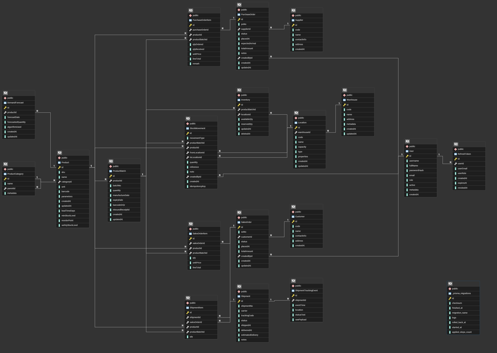

# Database Design

## Overview

The system implements a **Polyglot Persistence** strategy, using PostgreSQL for transactional data and MongoDB for operational data with TTL requirements. This document describes the database schema, design decisions, and data ownership model.

## PostgreSQL Schema (Transactional Data)

### Entity Relationship Diagram



### Schema Overview

**19 Tables organized by Bounded Context:**

| Module                   | Tables                                        | Purpose                                                      |
| ------------------------ | --------------------------------------------- | ------------------------------------------------------------ |
| **Product Management**   | ProductCategory, Product, ProductBatch        | Product catalog, hierarchical categories, batch/lot tracking |
| **Warehouse Management** | Warehouse, Location                           | Physical facilities and storage locations                    |
| **Inventory Management** | Inventory, StockMovement                      | Stock levels and movement history                            |
| **Procurement**          | Supplier, PurchaseOrder, PurchaseOrderItem    | Supplier management and inbound orders                       |
| **Sales**                | Customer, SalesOrder, SalesOrderItem          | Customer management and outbound orders                      |
| **Logistics**            | Shipment, ShipmentItem, ShipmentTrackingEvent | Delivery management and tracking                             |
| **Demand Planning**      | DemandForecast                                | Sales forecasting and demand prediction                      |
| **User Management**      | User, RefreshToken                            | Authentication and authorization                             |

### Key Design Patterns

**1. Hierarchical Data (Self-Referencing)**

- `ProductCategory.parentId` → Self-reference for category tree structure
- Supports unlimited depth for category hierarchies

**2. Order-Item Pattern**

- `PurchaseOrder` ↔ `PurchaseOrderItem` (one-to-many)
- `SalesOrder` ↔ `SalesOrderItem` (one-to-many)
- `Shipment` ↔ `ShipmentItem` (one-to-many)
- Supports multiple line items per order/shipment

**3. Batch/Lot Tracking**

- `Product` → `ProductBatch` (one-to-many)
- Tracks manufacture date, expiry date, batch numbers
- Critical for FIFO/FEFO inventory management

**4. Location-Based Inventory**

- `Inventory` references both `ProductBatch` and `Location`
- Unique constraint: `(productBatchId, locationId)` prevents duplicate inventory records
- Supports multi-warehouse, multi-location stock tracking

**5. Soft Delete**

- `Inventory.deletedAt` allows soft deletion without losing history
- Enables inventory reconciliation and audit trails

**6. Idempotency**

- `StockMovement.idempotencyKey` prevents duplicate stock movements
- Ensures exactly-once processing for critical operations

### Foreign Key Relationships

**Core Entity Dependencies:**

```
Product ← ProductBatch ← Inventory → Location → Warehouse
Product ← PurchaseOrderItem → PurchaseOrder → Supplier
Product ← SalesOrderItem → SalesOrder → Customer
Product ← ShipmentItem → Shipment
Product ← DemandForecast
Product ← StockMovement
```

**User Activity Tracking:**

```
User → PurchaseOrder (createdBy)
User → SalesOrder (createdBy)
User → StockMovement (createdBy)
User → RefreshToken
```

### Indexes

**Performance-Critical Indexes:**

- `Product.sku` - Fast product lookup by SKU
- `Inventory.locationId`, `Inventory.productBatchId` - Inventory queries
- `Inventory.deletedAt` - Filter active inventory
- `PurchaseOrder.status`, `PurchaseOrder.supplierId` - Order filtering
- `SalesOrder.status` - Order management
- `Location.warehouseId` - Location lookup by warehouse

### Enums

The schema defines 5 enums for controlled vocabularies:

- `OrderStatus`: pending, approved, processing, shipped, closed, cancelled
- `PoStatus`: draft, ordered, received, partial, cancelled
- `StockMovementType`: purchase_receipt, sale_issue, adjustment, transfer_in, transfer_out, returned, reservation, release, consumption
- `ShipmentStatus`: preparing, in_transit, delivered, delayed, cancelled
- `UserRole`: admin, manager, warehouse_staff, procurement, sales, logistics, analyst, partner

## MongoDB Collections (Operational Data)

### Collection: `audit_logs`

**Purpose**: Compliance logging and security audit trails

**Schema**:

```javascript
{
  _id: ObjectId,
  entityType: String,      // e.g., "Product", "SalesOrder"
  entityId: String,         // UUID of the affected entity
  action: String,           // "CREATE", "UPDATE", "DELETE"
  userId: String,           // UUID of user who performed action
  userEmail: String,
  metadata: Object,         // Additional context (IP, user agent, etc.)
  oldValue: Object,         // Previous state (for UPDATE)
  newValue: Object,         // New state (for CREATE/UPDATE)
  createdAt: Date
}
```

**Indexes**:

- `entityType` + `entityId` (compound) - Query logs for specific entity
- `userId` - Query logs by user
- `createdAt` - Time-based queries
- **TTL Index**: `createdAt` with expireAfterSeconds: 15552000 (180 days)

**Use Cases**:

- Compliance auditing (who changed what, when)
- Security investigations
- Data recovery (old values stored)
- User activity monitoring

---

### Collection: `alerts`

**Purpose**: Real-time event notifications and warnings

**Schema**:

```javascript
{
  _id: ObjectId,
  type: String,             // "LOW_STOCK", "EXPIRING_SOON"
  severity: String,         // "WARNING", "CRITICAL"
  message: String,          // Human-readable alert message
  isRead: Boolean,          // User acknowledgment status
  relatedEntity: {
    type: String,           // "Product", "Inventory"
    id: ObjectId            // Reference to related entity
  },
  createdAt: Date,
  updatedAt: Date
}
```

**Indexes**:

- `type` - Filter by alert type
- `severity` - Filter by severity level
- `isRead` - Show unread alerts
- **TTL Index**: `createdAt` with expireAfterSeconds: 7776000 (90 days)

**Use Cases**:

- Low stock warnings (when inventory < minStockLevel)
- Product expiry alerts (when expiry date approaching)
- User notification center
- Real-time dashboard alerts

---

### Why MongoDB for These Collections?

| Feature                | `audit_logs`                                | `alerts`                       |
| ---------------------- | ------------------------------------------- | ------------------------------ |
| **Write Pattern**      | High frequency, append-only                 | Moderate frequency, stateful   |
| **Read Pattern**       | Infrequent (compliance queries)             | Frequent (user dashboards)     |
| **TTL Requirement**    | 180 days auto-expiration                    | 90 days auto-expiration        |
| **Schema Flexibility** | metadata, oldValue, newValue vary by entity | relatedEntity structure varies |
| **Data Volume**        | High (every CRUD operation logged)          | Moderate (event-driven)        |

**Advantages**:

- Automatic TTL-based cleanup (no manual archival jobs)
- Flexible schema for varying metadata structures
- Optimized for append-heavy workloads
- Separation of operational data from transactional data

## Migration History

Database schema evolves through Prisma migrations:

| Migration                                                | Date       | Description                                                                                                    |
| -------------------------------------------------------- | ---------- | -------------------------------------------------------------------------------------------------------------- |
| `20250925153517_init_schema`                             | 2025-09-25 | Initial schema: Product, Warehouse, Inventory, Orders, Shipment                                                |
| `20251001103958_init_auth`                               | 2025-10-01 | Added User and RefreshToken tables                                                                             |
| `20251004082833_fix_inventory_updated_at`                | 2025-10-04 | Fixed Inventory.updatedAt auto-update                                                                          |
| `20251004102841_add_stockmovement_idempotency`           | 2025-10-04 | Added idempotencyKey to StockMovement                                                                          |
| `20251009110000_supplier_contactinfo_gin`                | 2025-10-09 | Added GIN index for Supplier.contactInfo JSON queries                                                          |
| `20251013102405_add_inventory_deleted_at`                | 2025-10-13 | Added soft delete support for Inventory                                                                        |
| `20251110030000_drop_auditlog_alert_legacy`              | 2025-11-10 | Dropped legacy AuditLog and Alert tables (moved to MongoDB)                                                    |
| `20251119075108_feat_demand_planning_and_alerts_support` | 2025-11-19 | Added DemandForecast table, Product alert fields (minStockLevel, reorderPoint, leadTimeDays, safetyStockLevel) |
| `20251203000000_add_sales_analyst_roles`                 | 2025-12-03 | Added `sales` and `analyst` roles to UserRole enum                                                             |

**Migration Commands**:

```bash
# Generate migration after schema changes
npx prisma migrate dev --name descriptive_migration_name

# Apply migrations to production
npx prisma migrate deploy
```

## Design Rationale

**Why PostgreSQL for Transactional Data?**

- ACID compliance for orders, inventory, payments
- Complex JOIN queries across multiple tables
- Referential integrity (foreign keys prevent orphaned records)
- Strong consistency for financial and inventory data
- Battle-tested for high-volume transactional workloads

**Why MongoDB for Operational Data?**

- TTL indexes eliminate need for manual data archival
- Schema flexibility for varying metadata structures
- High write throughput for audit logs
- Document model fits nested structures (relatedEntity, metadata)
- Operational data isolated from critical transactional data

**Why Prisma ORM?**

- Type-safe database queries (TypeScript integration)
- Declarative schema definition
- Automatic migration generation
- Excellent developer experience
- Built-in connection pooling

## Data Consistency Strategy

**Strong Consistency (PostgreSQL)**:

- All transactional operations use database transactions
- Foreign key constraints prevent invalid references
- Unique constraints prevent duplicates
- Rollback on error ensures data integrity

**Eventual Consistency (Cross-Database)**:

- Audit logs written asynchronously (non-blocking)
- Alert creation does not block business operations
- MongoDB writes are fire-and-forget for non-critical data
- Retry mechanisms for failed MongoDB writes

## Backup & Recovery

**PostgreSQL**:

- Daily automated backups via `pg_dump`
- Point-in-time recovery (PITR) enabled
- Backup retention: 30 days
- Restore test performed monthly

**MongoDB**:

- Daily automated backups via `mongodump`
- Backup retention: 30 days (operational data has TTL, less critical)
- Collections can be rebuilt from PostgreSQL if needed (audit logs regenerated)

## Future Enhancements

- **Read Replicas**: Add PostgreSQL read replicas for reporting queries
- **Partitioning**: Partition large tables (StockMovement, audit_logs) by date
- **Materialized Views**: Create CQRS read models for complex reports
- **Sharding**: Shard MongoDB collections if volume exceeds single-node capacity
- **CDC Pipeline**: Implement Change Data Capture for real-time analytics
