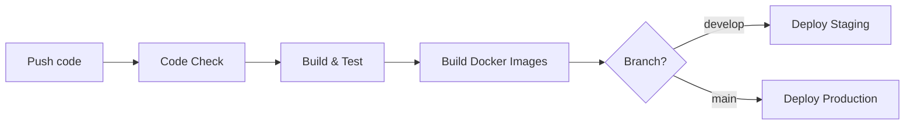

# 🧭 RUNBOOK - Warehouse Management System

## 1. Triển khai hệ thống (Deployment)

### 1.1 Mô hình tổng quan
Hệ thống Warehouse Management System được triển khai trên nền tảng **Azure Cloud**, bao gồm:
- **Frontend**: Ứng dụng React, chạy trên **Azure App Service**
- **Backend**: API NestJS (Node.js 20 LTS), chạy trên **Azure App Service**
- **Database**: PostgreSQL (Neon DB) và MongoDB (MongoDB Atlas)
- **Container Registry**: GitHub Container Registry (GHCR)
- **Hạ tầng** được quản lý bằng **Terraform** (IaC), triển khai qua **GitHub Actions**

Cấu trúc thư mục hạ tầng nằm tại `./iac/`, gồm:
```
iac/
├── modules/
│   ├── app-service/
│   ├── database/
│   ├── monitoring/
│   └── networking/
├── environments/
│   ├── production/
│   └── staging/
└── scripts/
```

---

### 1.2 Quy trình triển khai thủ công (Terraform)

**Điều kiện tiên quyết:**
- Đã cài đặt Terraform >= 1.5
- Có quyền truy cập Azure CLI và tài khoản có quyền Contributor
- Biến môi trường `ARM_SUBSCRIPTION_ID`, `ARM_CLIENT_ID`, `ARM_CLIENT_SECRET`, `ARM_TENANT_ID` được cấu hình

**Các bước triển khai:**

```bash
# 1. Đăng nhập vào Azure
az login

# 2. Di chuyển đến thư mục môi trường (ví dụ: staging)
cd iac/environments/staging

# 3. Khởi tạo Terraform
terraform init

# 4. Kiểm tra kế hoạch triển khai
terraform plan -out=tfplan

# 5. Áp dụng cấu hình
terraform apply "tfplan"
```

**Kết quả mong đợi:**
- Tạo đầy đủ các tài nguyên: App Service, Database, VNet, Monitoring, Key Vault.
- Tên tài nguyên tuân theo quy tắc `{project}-{env}-{resource-type}`  
  Ví dụ: `warehouse-mgmt-production-postgres`

---

### 1.3 Quy trình CI/CD tự động (GitHub Actions)

Hệ thống sử dụng nhiều workflow để đảm bảo chất lượng và triển khai tự động:

#### Workflow chính

| Workflow | File | Mục đích |
|----------|------|----------|
| **Code Check** | `code-check.yml` | Kiểm tra lint, type, formatting |
| **Test Matrix** | `test-matrix.yml` | Chạy unit/integration/smoke tests |
| **Deploy Apps** | `deploy-apps.yml` | Build và deploy ứng dụng |
| **Deploy Infrastructure** | `deploy-infrastructure.yml` | Triển khai hạ tầng Terraform |

#### Luồng triển khai ứng dụng (`deploy-apps.yml`)



**Chi tiết từng bước:**

1. **Code Check**: Chạy ESLint, TypeScript type check, Prettier formatting
2. **Build & Test**: 
   - Unit tests (mock dependencies)
   - Integration tests (Testcontainers cho PostgreSQL + MongoDB)
   - Smoke tests (kiểm tra khởi động ứng dụng)
3. **Build Docker Images**: Build và push lên GitHub Container Registry
4. **Deploy**: Triển khai đến staging hoặc production

#### Testcontainers trong CI

Integration tests sử dụng **Testcontainers** để tự động provision databases:

```bash
# Chạy integration tests
./scripts/run-tests-by-type.sh integration

# Biến môi trường CI cần thiết
TESTCONTAINERS_HOST_OVERRIDE=localhost
TESTCONTAINERS_RYUK_DISABLED=true
```

**Các secrets cần thiết trong GitHub:**
- `AZURE_CREDENTIALS` - Azure Service Principal JSON
- `ARM_SUBSCRIPTION_ID`, `ARM_CLIENT_ID`, `ARM_CLIENT_SECRET`, `ARM_TENANT_ID`
- `EXTERNAL_POSTGRES_URL`, `EXTERNAL_MONGODB_URL` - Database connection strings
- `JWT_ACCESS_SECRET_*`, `JWT_REFRESH_SECRET_*` - JWT secrets
- `DOCKER_REGISTRY_USERNAME`, `DOCKER_REGISTRY_PASSWORD` - GHCR credentials

---

### 1.4 Blue-Green Deployment (Production)

Production sử dụng mô hình **Blue-Green Deployment** với Azure App Service Deployment Slots:

```
┌─────────────────────────────────────────────────────────┐
│                    Azure App Service                     │
├─────────────────────────────────────────────────────────┤
│  Production Slot (Blue)  ←──┐                           │
│  - Đang phục vụ traffic     │  Swap                     │
│                             │                           │
│  Staging Slot (Green)    ───┘                           │
│  - Deploy bản mới trước                                 │
│  - Health check trước khi swap                          │
└─────────────────────────────────────────────────────────┘
```

**Quy trình triển khai production:**

1. **Deploy to Staging Slot**: Bản mới được deploy vào staging slot
2. **Health Check**: Kiểm tra `/health` endpoint trả về HTTP 200
3. **Slot Swap**: Hoán đổi staging ↔ production (zero-downtime)
4. **Final Health Check**: Xác nhận production hoạt động bình thường

**Lợi ích:**
- Zero-downtime deployment
- Rollback nhanh chóng (swap ngược lại)
- Kiểm tra bản mới trước khi expose cho users

**Rollback nhanh:**
```bash
# Swap lại để rollback
az webapp deployment slot swap \
  --resource-group warehouse-mgmt-production-rg \
  --name warehouse-mgmt-production-backend \
  --slot staging \
  --target-slot production
```

> 📖 Chi tiết về rollback: Xem [ROLLBACK_PLAYBOOK.md](./ROLLBACK_PLAYBOOK.md)

---

### 1.5 Docker Container Registry (GHCR)

Ứng dụng được đóng gói thành Docker images và lưu trữ trên **GitHub Container Registry**.

#### Naming Convention

```
ghcr.io/se214-semicolon/warehouse-and-supply-chain-management-system/backend
ghcr.io/se214-semicolon/warehouse-and-supply-chain-management-system/frontend
```

#### Image Tags

| Tag Pattern | Mô tả | Ví dụ |
|-------------|-------|-------|
| `latest` | Main branch mới nhất | `backend:latest` |
| `develop` | Develop branch | `backend:develop` |
| `{branch}-{sha}` | Specific commit | `backend:main-abc1234` |

#### Lệnh hữu ích

```bash
# Đăng nhập GHCR
echo $GITHUB_TOKEN | docker login ghcr.io -u USERNAME --password-stdin

# Pull image
docker pull ghcr.io/se214-semicolon/warehouse-and-supply-chain-management-system/backend:latest

# Xem tags có sẵn
# → Truy cập: https://github.com/orgs/SE214-Semicolon/packages
```

---

### 1.6 Biến môi trường & Secrets quan trọng

| Biến | Mô tả |
|------|-------|
| `APP_VERSION` | Phiên bản ứng dụng (ví dụ 1.0.0) |
| `NODE_ENV` | staging/production |
| `PORT` | Cổng chạy backend (3000) |
| `FRONTEND_URL` | URL của ứng dụng React |
| `DATABASE_URL` | Connection string PostgreSQL |
| `MONGO_URL` | Connection string MongoDB |
| `JWT_ACCESS_SECRET` | Secret cho access token |
| `JWT_REFRESH_SECRET` | Secret cho refresh token |

---

## 2. Giám sát & Theo dõi (Monitoring)

### 2.1 Công cụ giám sát

Hệ thống sử dụng stack monitoring sau:
- **Azure Application Insights**: APM, request tracking, error logging
- **Azure Managed Grafana**: Dashboard visualization
- **Azure Monitor Workspace (Prometheus)**: Metrics storage

Các chỉ số quan trọng:
| Metric | Ngưỡng bình thường |
|--------|-------------------|
| Response Time (P95) | < 500ms |
| Error Rate | < 1% |
| CPU Usage | < 80% |
| Memory Usage | < 85% |

> 📖 Chi tiết cấu hình: Xem [MONITORING.md](./MONITORING.md)

---

### 2.2 Xem log & truy vết lỗi

**Application Insights:**
- Mở Azure Portal → Application Insights → Logs  
- Truy vấn log bằng **Kusto Query Language (KQL)**:
```kql
requests
| where success == false
| sort by timestamp desc
| take 20
```

**Backend logs (realtime):**
```bash
az webapp log tail \
  --name warehouse-mgmt-production-backend \
  --resource-group warehouse-mgmt-production-rg
```

---

### 2.3 Cảnh báo và hành động khắc phục

**Ngưỡng cảnh báo (Alert Rules):**
- P95 latency > 1s  
- Error rate > 5%  
- CPU > 80% trong 10 phút liên tục  
- Kết nối database vượt 80% giới hạn

**Hành động khắc phục:**
1. Kiểm tra log để xác định lỗi
2. Nếu do lỗi ứng dụng → **Rollback** theo [ROLLBACK_PLAYBOOK.md](./ROLLBACK_PLAYBOOK.md)
3. Nếu do hạ tầng → Scale-out tạm thời App Service
4. Gửi báo cáo sự cố lên GitHub issue

---

### 2.4 Health Check Procedures

Sử dụng script để kiểm tra health:

```bash
# Từ thư mục iac/scripts/
./health-check.sh staging    # Kiểm tra staging
./health-check.sh production # Kiểm tra production
```

Hoặc kiểm tra thủ công:
```bash
# Backend health
curl -s https://warehouse-mgmt-production-backend.azurewebsites.net/health

# Frontend health  
curl -s https://warehouse-mgmt-production-frontend.azurewebsites.net/health
```

---

## 3. Sao lưu & Phục hồi (Backup)

### 3.1 Cấu hình sao lưu

**Neon DB (PostgreSQL):**
- Point-in-Time Restore (PITR) tự động
- Có thể tạo branch thủ công định kỳ
- Xem chi tiết tại: https://console.neon.tech

**MongoDB Atlas:**
- Continuous Backup với retention 30 ngày
- Point-in-Time Restore khả dụng

**Terraform State:**
- Lưu trong Azure Storage Container (`tfstate`)
- Versioning được bật

---

### 3.2 Phục hồi dữ liệu

**Neon DB:**
1. Truy cập Neon Console
2. Chọn project → Branches → "Branch from point in time"
3. Chọn thời điểm cần khôi phục
4. Cập nhật connection string trong cấu hình

**MongoDB Atlas:**
1. Truy cập Atlas Console
2. Database → Browse Collections → Restore
3. Chọn thời gian khôi phục

> 📖 Quy trình chi tiết: Xem [ROLLBACK_PLAYBOOK.md](./ROLLBACK_PLAYBOOK.md)

---

## 4. Nhiệm vụ định kỳ (Routine Tasks)

### 4.1 Hàng ngày
- [ ] Kiểm tra logs lỗi trong Application Insights
- [ ] Đảm bảo các service hoạt động bình thường (App Service, DB)
- [ ] Kiểm tra dung lượng đĩa PostgreSQL

### 4.2 Hàng tuần
- [ ] Xem báo cáo hiệu năng hệ thống (CPU, Memory)
- [ ] Kiểm tra cấu hình alert có hoạt động đúng không
- [ ] Đảm bảo Terraform state và backup được cập nhật
- [ ] Review failed GitHub Actions runs

### 4.3 Hàng tháng
- [ ] Kiểm tra lại quyền truy cập (RBAC, Managed Identity)
- [ ] Cập nhật phiên bản Node.js, package dependencies
- [ ] Đánh giá chi phí vận hành Azure và tối ưu tài nguyên
- [ ] Rotate JWT secrets nếu cần

---

## 5. Phụ lục

### 5.1 Liên hệ và vai trò

| Vai trò | Người phụ trách | Ghi chú |
|----------|----------------|---------|
| DevOps Engineer | Sinh viên phụ trách hạ tầng | Quản lý Terraform, CI/CD |
| Backend Lead | Thành viên backend | Giám sát API, log |
| Frontend Lead | Thành viên frontend | Triển khai giao diện |
| Giảng viên | Người hướng dẫn đồ án | Giám sát & đánh giá |

### 5.2 Tài liệu liên quan

| Tài liệu | Đường dẫn |
|----------|-----------|
| Kiến trúc hệ thống | [ARCHITECTURE.md](./ARCHITECTURE.md) |
| Cấu hình database | [DATABASE.md](./DATABASE.md) |
| Hướng dẫn monitoring | [MONITORING.md](./MONITORING.md) |
| Phân quyền RBAC | [RBAC.md](./RBAC.md) |
| **Quy trình rollback** | [ROLLBACK_PLAYBOOK.md](./ROLLBACK_PLAYBOOK.md) |
| Hướng dẫn IaC | [iac/README.md](../iac/README.md) |

### 5.3 Quick Commands Reference

```bash
# ===== Deployment =====
# Trigger manual deployment
gh workflow run deploy-apps.yml -f environment=staging

# ===== Health Checks =====
./iac/scripts/health-check.sh production

# ===== Logs =====
az webapp log tail --name warehouse-mgmt-production-backend --resource-group warehouse-mgmt-production-rg

# ===== Rollback (Slot Swap) =====
az webapp deployment slot swap \
  --resource-group warehouse-mgmt-production-rg \
  --name warehouse-mgmt-production-backend \
  --slot staging --target-slot production

# ===== Terraform =====
cd iac/environments/production
terraform plan
terraform apply

# ===== Docker =====
docker pull ghcr.io/se214-semicolon/warehouse-and-supply-chain-management-system/backend:latest
```
